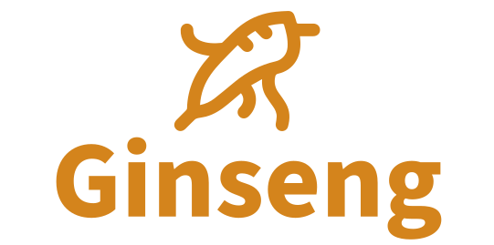
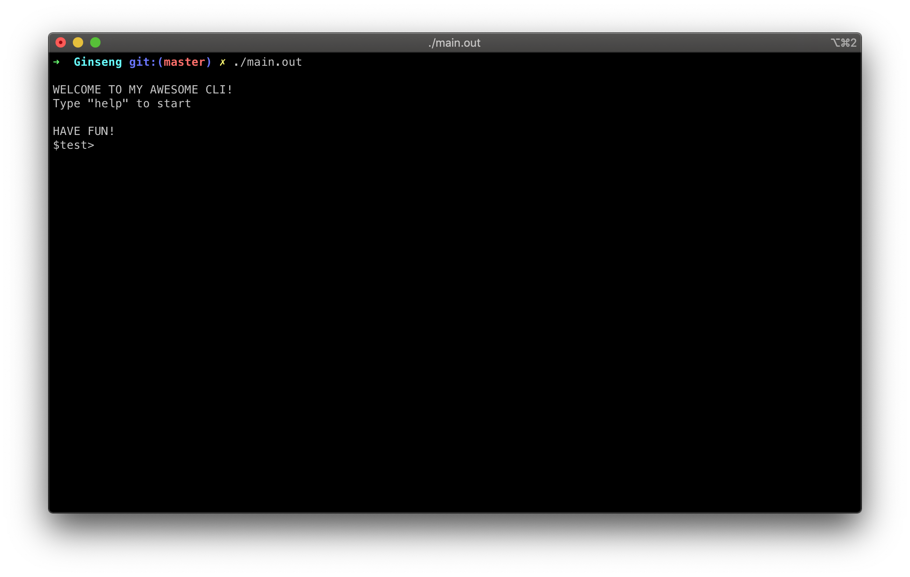

<!-- PROJECT LOGO -->
<p align="center">
  <a href="https://github.com/chewax/Ginseng">
    
  </a>
</p>

<br>

[![Contributors][contributors-shield]][contributors-url]
[![Issues][issues-shield]][issues-url]
[](https://travis-ci.org/chewax/Ginseng)
[![Last Commit][last-commit-shield]][last-commit-url]
[![MIT License][license-shield]][license-url]


<!-- TABLE OF CONTENTS -->
## Table of Contents

* [About the Project](#about-the-project)
* [Getting Started](#getting-started)
* [Usage](#usage)
* [Roadmap](#roadmap)
* [Contributing](#contributing)
* [License](#license)
* [Contact](#contact)


<!-- ABOUT THE PROJECT -->
## About The Project


 
This is a lightweight header only library that will help you build REPL tools faster.


<!-- GETTING STARTED -->
## Getting Started

To get a local copy up and running follow these simple steps.

### Prerequisites

This library requires c++11.

### Installation

1. Clone the Ginseng into repo into your libs  

```sh
git clone https://github.com/chewax/Ginseng.git
```

<!-- USAGE EXAMPLES -->
## Usage

### Basic usage.

```c++
#include "Ginseng.h"

int main() 
{
	Ginseng repl;
	repl.start();
	return 0;
}
```

This example will setup a basic REPL tool with empty commands. At this stage you can use commands such as ``help`` or ``exit``.

### Configuring Delimiter.

You can setup your own delimiter using the first parameter for such thing.

```c++
#include "Ginseng.h"

int main() 
{
	Ginseng repl("$delim>");
	repl.start();
	return 0;
}
```

### Configuring custom greet and farewell functions.

Ginseng will let you handle certain events in your REPL. Such is the case of (obviously) commands. But also you can set up handlers for greet and goodbye if you wish.

```c++
#include "Ginseng.h"

int main() 
{
	
	Ginseng repl("$test>", []()
	{
		std::cout << "\nWELCOME TO MY AWESOME RELP!" << "\n";
		std::cout << "Type \"help\" to start" << "\n";
		std::cout << "" << "\n";
		std::cout << "HAVE FUN!" << "\n";
	},
	[]()
	{
		std::cout << "\nBye My friend!" << "\n";
	});
	repl.start();
	return 0;
}
```


### Setting up commands.

Commands can be created using ``add_command`` funciton.
Such function receives 3 paramenters
Namely:
	1. Command Name
	2. Command Handler (or Callback)
	3. Command Help Struct

Help struct is used to let Ginseng know how to print help information.
Help struct is just 2 strings one for the argument list and one for the actual description.

```
Help hello_h("Says hello back at you", "[name]");
```

Callback function will be called passing a vector contining the list of arguments (including the command name) collected from the console.
Vector will contain at least 1 element = the command name.  

Callback funciton is required to return a success/fail return type Exit.
Possible values are

```
	SUCCESS | INVALID_ARGUMENTS | ERROR
```
This is important to let Ginseng know of the result of the command.


**Here is the final code for a more advanced setup with "Hello" Command:**

```c++
#include "Ginseng.h"

int main() 
{
	//Create Ginseng REPL
	Ginseng repl("$test>", []()
	{
		std::cout << "\nWELCOME TO MY AWESOME REPL!" << "\n";
		std::cout << "Type \"help\" to start" << "\n";
		std::cout << "" << "\n";
		std::cout << "HAVE FUN!" << "\n";
	},
	[]()
	{
		std::cout << "\nBye My friend!" << "\n";
	});
	
	//Create Help struct for hello command
	Help hello_h("Says hello back at you", "[name]");
	
	//Add command to the REPL
	repl.add_command("hello", [](std::vector<std::string> args) -> int
	{ 
		if (args.size() < 2) return Exit::INVALID_ARGUMENTS;
		std::cout << "HELLO " << args[1] << std::endl; 
		return Exit::SUCCESS;
	}, hello_h);
  
	repl.start();
	return 0;
}
```


<!-- ROADMAP -->
## Roadmap

See the [open issues](https://github.com/chewax/Ginseng/issues) for a list of proposed features (and known issues).


<!-- CONTRIBUTING -->
## Contributing

Contributions are what make the open source community such an amazing place to be learn, inspire, and create. Any contributions you make are **greatly appreciated**.

1. Fork the Project
2. Create your Feature Branch (`git checkout -b feature/AmazingFeature`)
3. Commit your Changes (`git commit -m 'Add some AmazingFeature'`)
4. Push to the Branch (`git push origin feature/AmazingFeature`)
5. Open a Pull Request


<!-- LICENSE -->
## License

Distributed under the MIT License. See `LICENSE` for more information.


<!-- CONTACT -->
## Contact

[![LinkedIn][linkedin-shield]][linkedin-url]
  
Project Link: [https://github.com/chewax/Ginseng](https://github.com/chewax/Ginseng)


<!-- MARKDOWN LINKS & IMAGES -->
<!-- https://www.markdownguide.org/basic-syntax/#reference-style-links -->
[contributors-shield]: https://img.shields.io/github/contributors/chewax/Ginseng.svg
[contributors-url]: https://github.com/chewax/Ginseng/graphs/contributors
[forks-shield]: https://img.shields.io/github/forks/chewax/Ginseng.svg
[forks-url]: https://github.com/chewax/Ginseng/network/members
[stars-shield]: https://img.shields.io/github/stars/chewax/Ginseng.svg
[stars-url]: https://github.com/chewax/Ginseng/stargazers
[issues-shield]: https://img.shields.io/github/issues/chewax/Ginseng.svg
[issues-url]: https://github.com/chewax/Ginseng/issues
[license-shield]: https://img.shields.io/github/license/chewax/Ginseng.svg
[license-url]: https://github.com/chewax/Ginseng/blob/master/LICENSE.txt
[linkedin-shield]: https://img.shields.io/badge/-LinkedIn-black.svg?&logo=linkedin&colorB=555
[linkedin-url]: https://linkedin.com/in/dwaksman
[product-screenshot]: images/screenshot.png
[last-commit-shield]: https://img.shields.io/github/last-commit/chewax/Ginseng
[last-commit-url]: https://github.com/last-commit/chewax/Ginseng
